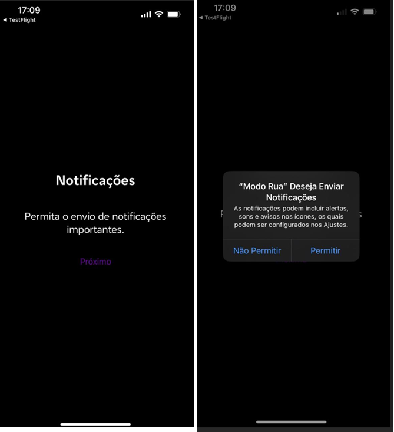

# Permissões

### Notificações

* **Título**: Notificações
* **Descrição**: Permita o envio de notificações importantes.
* **Botão**: Próximo
* **Título do pop-up**: "Modo Rua" Deseja Enviar Notificações
* **Descrição do pop-up**: As notificações podem incluir alertas, sons e avisos nos ícones, os quais podem ser configurados nos Ajustes.
* **Botões do pop-up**: Não Permitir, Permitir

<figure><figcaption></figcaption></figure>

### Localização

* **Título**: Localização
* **Descrição**: Precisamos acessar sua localização.
* **Botão**: Próximo
* **Título do pop-up**: Permitir que "Modo Rua" use a sua localização?
* **Descrição do pop-up**: Este aplicativo precisa acessar sua localização enquanto estiver em uso.
* **Botões do pop-up**: Permitir Uma Vez, Permitir Durante o Uso do App, Não Permitir

<figure><figcaption></figcaption></figure>

### Screen Time

* **Título**: Screen Time
* **Descrição**: Precisamos de acesso ao Tempo de Tela.
* **Botão**: Próximo
* **Título do pop-up**: "Modo Rua" Deseja Acessar o Tempo de Uso
* **Descrição do pop-up**: Se "Modo Rua" tiver acesso ao Tempo de Uso, poderá ver seus dados de atividade, conteúdo restrito e limite de uso de apps e sites.
* **Botões do pop-up**: Continuar, Não Permitir

<figure><figcaption></figcaption></figure>

### Permitir Acesso ao Tempo de Uso

* **Título do pop-up**: Permitir Acesso ao Tempo de Uso
* **Descrição do pop-up**: Se "Modo Rua" tiver acesso ao Tempo de Uso, poderá ver seus dados de atividade, conteúdo restrito e limite de uso de apps e sites. Em Opções de Tempo de Uso nos Ajustes, você pode controlar quais apps acessam suas informações.
* **Botões do pop-up**: Permitir com Face ID, Não Permitir
* **Link no pop-up**: Saiba mais...
* **Título**: "Modo Rua" Recebeu Aprovação para Acessar o Tempo de Uso
* **Descrição**: "Usuário aprovou que "Modo Rua" acesse o Tempo de Uso neste iPhone.
* **Botão**: OK

<figure><figcaption></figcaption></figure>

####
